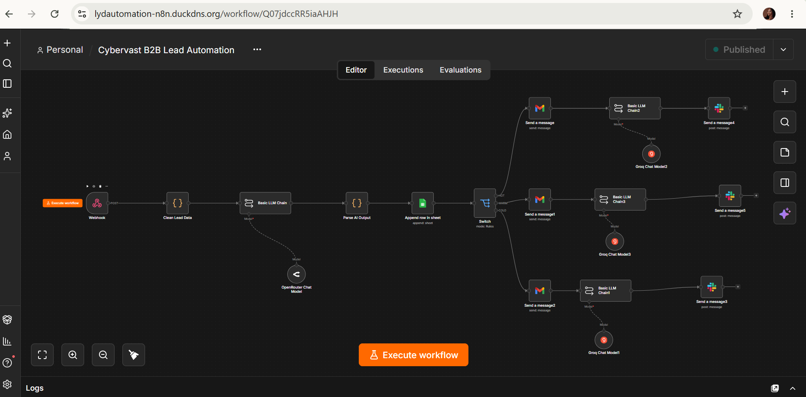
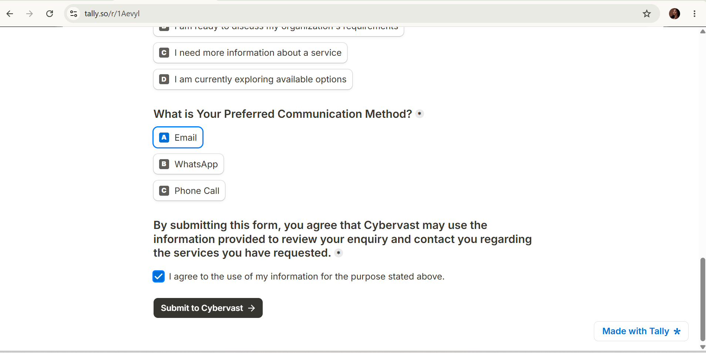
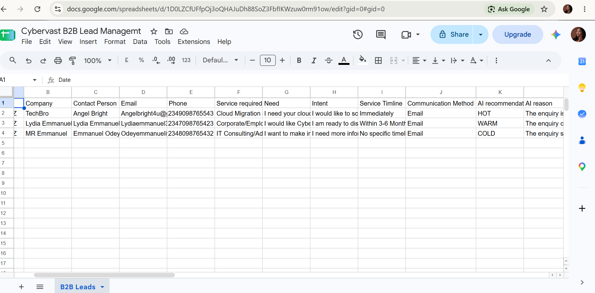
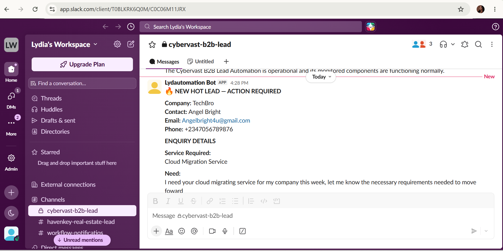
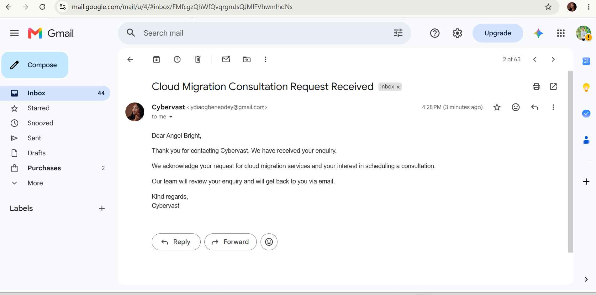

# Cybervast B2B AI Lead Qualification & Follow-Up Workflow

An AI-powered B2B lead qualification and follow-up workflow developed as a team capstone project during the Cybervast AI Automation program.

The system is designed to help organize incoming business enquiries, assess lead readiness, recommend appropriate lead categories, and route prospects for the right level of follow-up while keeping final decisions under human control.

## The Problem

Cybervast receives B2B enquiries from organizations and businesses interested in services such as technology training, digital transformation, and cloud-related solutions.

The existing online enquiry process did not automatically assess or prioritize incoming leads.

Each enquiry could require manual review to understand the prospect’s needs, determine their readiness, record the information, decide the appropriate follow-up, and initiate communication.

Without an automated qualification process, potentially high-priority enquiries may require additional manual effort to identify among other incoming leads.

## The Solution

Our team developed an AI-powered lead qualification and follow-up workflow that processes incoming B2B enquiries and recommends a lead category based on the information provided.

The system classifies leads into:

- **HOT** — requires sales attention
- **WARM** — requires follow-up
- **COLD** — suitable for nurturing

The AI provides a recommendation and supporting reasoning, while the final business decision remains with the human team.

Based on the recommended category, the workflow routes the enquiry through the appropriate follow-up path.

## Core Capabilities

- Capture incoming B2B enquiries
- Record lead information automatically
- Analyze enquiry information using AI
- Recommend HOT, WARM, or COLD lead classification
- Provide reasoning for the qualification recommendation
- Route leads according to their recommended category
- Send internal notifications for leads requiring attention
- Support follow-up communication
- Maintain lead records for tracking and review
- Keep final qualification and sales decisions under human control

## How It Works

A typical enquiry follows this process:

1. A prospect submits a B2B enquiry.
2. The workflow captures the submitted information.
3. The enquiry is recorded for tracking.
4. AI analyzes the prospect’s needs and readiness.
5. The system recommends a HOT, WARM, or COLD classification and provides a reason.
6. The lead is routed according to the recommended category.
7. HOT leads are surfaced for sales attention.
8. WARM leads are routed for follow-up.
9. COLD leads remain available for nurturing.
10. The business team retains control over the final decision and subsequent action.

## System Design

The system design shows the architecture, lead-routing logic, process flow, human oversight, and monitoring structure behind the Cybervast B2B AI Lead Qualification & Follow-Up Workflow.

[**View Cybervast System Design**](docs/cybervast-system-design.pdf)

## Demo

Watch the Cybervast B2B AI Lead Qualification & Follow-Up Workflow in action, from lead submission and AI-powered qualification to lead routing and follow-up.

[**Watch Cybervast Workflow Demo**](https://youtu.be/EMFwHWV5Ohg?si=YbXO-B1-aJkp6xPI)

## Project Screenshots

### Main Workflow Overview

The main n8n workflow manages the process from B2B enquiry capture and AI qualification to lead routing, internal notifications, and follow-up.

### B2B Enquiry Form

Prospects submit their business enquiry and relevant information through the enquiry form.

### Lead Records & AI Qualification

Lead information and AI qualification results are recorded in Google Sheets for tracking and review.

### HOT Lead Notification

HOT leads requiring sales attention are sent to the team through Slack with the prospect's information and AI qualification assessment.

### Lead Follow-Up Email

The workflow supports automated email communication as part of the lead follow-up process.

## Human-in-the-Loop Design

The workflow is designed to support sales teams rather than replace human judgment.

AI is used to analyze information, organize incoming enquiries, and recommend lead classifications. Final qualification, sales decisions, and important follow-up actions remain under human control.

This approach combines automation with human oversight where business judgment is required.

## Monitoring & Reliability

Supporting monitoring workflows were included to improve visibility into system performance.

These include:

- Error monitoring and alerts
- Daily system health checks

The monitoring layer helps identify workflow failures and verify that important components remain operational.

## Tech Stack

**Automation & Orchestration:** n8n  
**Lead Capture:** Tally  
**AI / LLM:** Groq  
**Lead Records:** Google Sheets  
**Internal Notifications:** Slack  
**Follow-Up Communication:** Gmail  
**Monitoring:** n8n error monitoring and daily health checks

## Project Context

This workflow was developed as a two-person team capstone project during the Cybervast AI Automation training program.

The solution was presented to Cybervast as part of the final project presentation. Following the demonstration, Cybervast indicated that the workflow would be considered for possible adoption.

## Privacy & Data Handling

Public demonstrations and documentation for this project use fictional or test lead information only.

No private business data, API keys, authentication tokens, credentials, or other sensitive information are included in the public project documentation.

---

**Team Project — Cybervast AI Automation Capstone**

**Lydia Ogbene Odey**  
AI Automation Specialist | Health Tech Automation | Sales & CRM Automation
